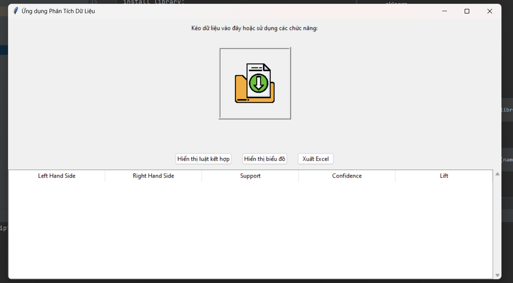
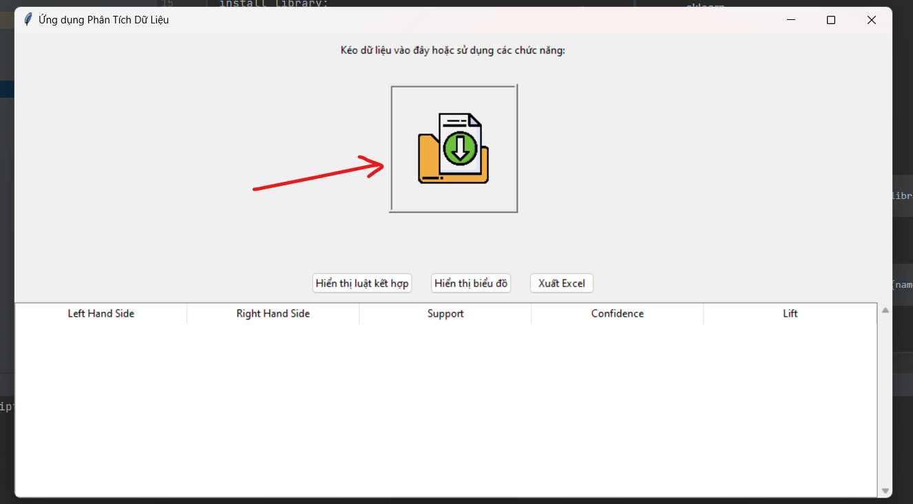
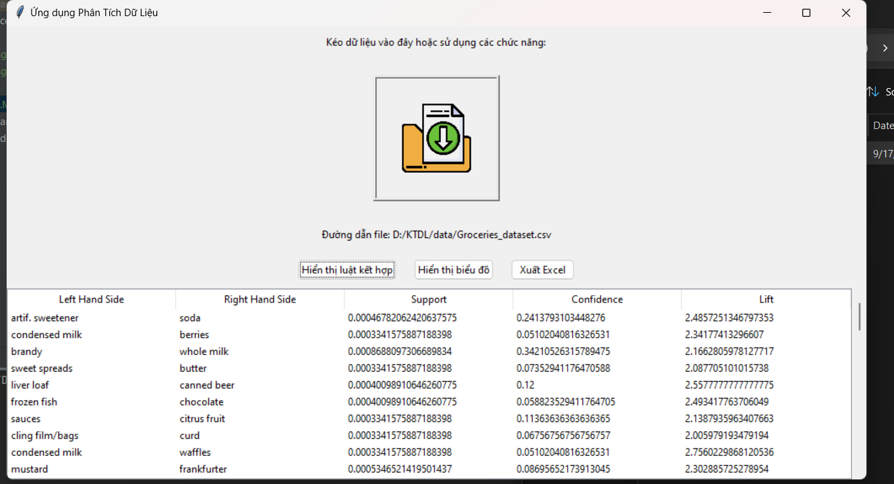
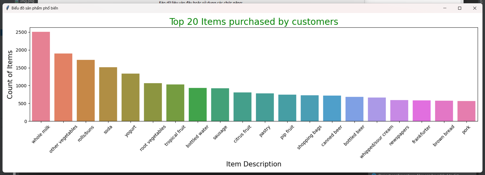
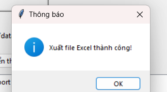

python version 3.10.0
library
 - tkinter
 - tkinterdnd2
 - pandas
 - sklearn
 - matplotlib
 - apyori
 - seaborn
 - openpyxl

    
install:

 install library: 
 
                        pip install {name_library}

or

                        py -m pip install {name_library}

run program:

 B1: run file main.py 
    

 B2: Drag your data into the program
    
 B3: Click "hiện thị luật kết hợp" to display the results as association rules
 

 - You can view the graph if you want by activating the "hiện thị biểu đồ" button
 
 --> Export your results to an excel file but you need to import the "openpyxl" library to do that
   

  